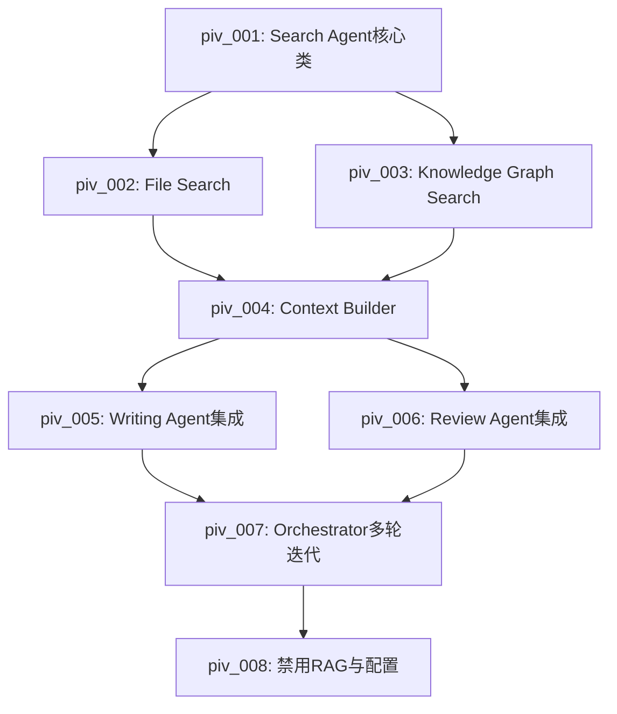

# PRP: 多Agent架构重构 - 统一检索服务与迭代优化

## 项目元数据

```yaml
项目名称: 多Agent架构重构 - Search Agent统一检索
项目ID: PRP-MA-001
创建日期: 2026-03-18
优先级: P0 (架构级改进)
预估工时: 8-10天
状态: PLANNING
Archon项目ID: f9ecaf8b-ff17-467d-bf29-37aae558bb4e
```

## 背景与问题陈述

### 当前问题

1. **检索逻辑重复**
   - Writing Agent: `writing_agent.py:82-86` (检索需求知识)
   - Review Agent: `review_agent.py:243-247` (检索标准规范)
   - Proofread Agent: `proofread_agent.py:214-218` (检索术语数据)
   - 相同的RAG调用模式重复3次，缺乏缓存机制

2. **多轮迭代支持不足**
   - Orchestrator状态机有12个状态，但缺少明确的迭代循环
   - 用户修改需求时需要重新开始流程
   - 无法基于反馈进行增量修改

3. **RAG检索质量问题**
   - 当前准确率: 70-80%
   - 缺少Token预算管理
   - 无分层检索策略
   - 无知识图谱辅助

### 目标指标

| 指标 | 当前值 | 目标值 | 改进幅度 |
|------|--------|--------|----------|
| 检索准确率 | 70-80% | >95% | +15-25% |
| 缓存命中率 | 0% | >80% | +80% |
| 重复代码行数 | ~150行 | 0行 | -100% |
| 多轮迭代支持 | 否 | 是（max 3轮） | 新增 |
| 平均响应时间 | ~2s | <1.5s | -25% |

## 技术方案

### 架构设计

```
┌─────────────────────────────────────────────────────────┐
│                    Orchestrator                         │
│  ┌─────────────────────────────────────────────────┐   │
│  │  迭代循环 (max 3轮)                              │   │
│  │  1. 意图识别 → 2. 任务分解                       │   │
│  │  3. Agent执行 → 4. 结果评估                     │   │
│  │  5. 用户反馈 → 6. 增量修改                      │   │
│  └─────────────────────────────────────────────────┘   │
└─────────────────────────────────────────────────────────┘
                          │
                          ▼
┌─────────────────────────────────────────────────────────┐
│                   Search Agent (NEW)                    │
│  ┌─────────────────────────────────────────────────┐   │
│  │  统一检索服务                                    │   │
│  │  • search(mode, query, budget) → contexts       │   │
│  │  • _files_only_search()       # 素材库检索      │   │
│  │  • _knowledge_only_search()   # 知识图谱检索    │   │
│  │  • _comprehensive_search()    # 综合检索        │   │
│  │  • _build_context()           # Token预算管理   │   │
│  │  • CacheManager               # 缓存机制        │   │
│  └─────────────────────────────────────────────────┘   │
└─────────────────────────────────────────────────────────┘
                          │
          ┌───────────────┼───────────────┐
          ▼               ▼               ▼
    ┌──────────┐    ┌──────────┐    ┌──────────┐
    │ Writing  │    │  Review  │    │ Proofread│
    │  Agent   │    │  Agent   │    │  Agent   │
    │ (改进)   │    │ (改进)   │    │ (改进)   │
    └──────────┘    └──────────┘    └──────────┘
         │                │                │
         └────────────────┴────────────────┘
                          │
                          ▼
              调用 Search Agent.search()
```

### 关键技术点

#### 1. Search Agent 统一检索服务

**检索模式**:
- `files_only`: 仅检索素材库文件（PDF/Word/TXT）
- `knowledge_only`: 仅检索知识图谱（术语/标准/规范）
- `comprehensive`: 综合检索（分层注入）

**Token预算管理**:
```python
class TokenBudget:
    MAX_TOKENS = 4000  # 总Token预算
    ALLOCATION = {
        "files": 0.6,      # 60% → 2400 tokens
        "knowledge": 0.3,  # 30% → 1200 tokens
        "buffer": 0.1      # 10% → 400 tokens (预留)
    }
```

**缓存策略**:
- LRU缓存（最近最少使用）
- 缓存键: `hash(query + mode + filters)`
- 缓存TTL: 300秒 (5分钟)
- 最大缓存条目: 1000

#### 2. 多轮迭代机制

**迭代循环**:
```python
class IterationManager:
    MAX_ITERATIONS = 3

    def process_feedback(self, feedback: UserFeedback):
        if feedback.type == "accept":
            return IterationResult.COMPLETE
        elif feedback.type == "modify":
            if self.current_iteration < self.MAX_ITERATIONS:
                return IterationResult.CONTINUE
            else:
                return IterationResult.MAX_REACHED
        else:  # reject
            return IterationResult.ABORT
```

**状态保持**:
- 保留前一轮的检索结果（缓存复用）
- 增量修改而非全量重生成
- 差异化对比和合并

#### 3. 知识图谱集成

**节点类型**:
- Term: 工艺术语
- Standard: 标准/规范
- Process: 工艺流程
- Material: 材料信息

**关系类型**:
- `is_a`: 继承关系
- `part_of`: 组成关系
- `related_to`: 关联关系
- `defined_by`: 定义来源

## PIV详细拆分

### piv_001: Search Agent核心类

```yaml
piv_001:
  标题: Search Agent核心类 - 统一检索服务基础
  文件: backend/app/agents/search/search_agent.py

  功能:
    1. search() 主方法 - 统一检索入口
       - 参数: mode (files/knowledge/comprehensive), query, token_budget
       - 返回: SearchContext对象（contexts + metadata）

    2. 缓存机制
       - 集成LRU缓存装饰器
       - 缓存键生成逻辑
       - 缓存命中/未命中统计

    3. 配置管理
       - 从环境变量读取MAX_TOKENS
       - 检索参数默认值

    4. 日志记录
       - 结构化日志（get_logger）
       - 检索耗时、缓存命中率等指标

    5. 错误处理
       - 统一异常捕获
       - 降级策略（检索失败返回空上下文）

  代码量: 200行 (含注释)
  依赖: 无
  验收标准:
    - search()方法可正常调用
    - 缓存命中率统计正常
    - 单元测试覆盖率 >90%
    - 集成测试通过（mock RAG服务）

  技术细节:
    - 使用@lru_cache装饰器
    - 异步支持（async/await）
    - 返回SearchContext数据类
```

### piv_002: File Search功能

```yaml
piv_002:
  标题: File Search功能 - 素材库文件检索
  文件: backend/app/agents/search/search_agent.py (扩展piv_001)

  功能:
    1. _files_only_search() 私有方法
       - 调用现有rag_retriever工具
       - 支持项目ID过滤（避免污染）
       - 返回文件内容列表

    2. Token预算计算
       - calculate_token_count() 辅助方法
       - tiktoken库集成（cl100k_base编码）
       - 按Token截断过长的检索结果

    3. 文件类型优先级
       - PDF > Word > TXT
       - 可配置的优先级策略

    4. 元数据提取
       - 文件名、页码、章节等
       - 附加到SearchContext.metadata

  代码量: 100行
  依赖: piv_001
  验收标准:
    - _files_only_search()返回正确结果
    - Token计算准确（误差<5%）
    - 文件过滤功能正常
    - 集成测试通过（真实素材库）

  技术细节:
    - 复用现有rag_retriever.py
    - 使用tiktoken计算Token
    - 支持chunk_size配置
```

### piv_003: Knowledge Graph Search功能

```yaml
piv_003:
  标题: Knowledge Graph Search功能 - 知识图谱检索
  文件: backend/app/agents/search/search_agent.py (扩展piv_001)

  功能:
    1. _knowledge_only_search() 私有方法
       - 查询知识图谱数据库
       - 支持术语、标准、流程节点检索
       - 返回结构化知识对象

    2. 图谱遍历算法
       - BFS广度优先搜索（相关节点）
       - 深度限制（max_depth=3）
       - 关系权重计算

    3. 实体识别
       - 从query中提取关键实体
       - 映射到知识图谱节点
       - 处理模糊匹配

    4. 结果排序
       - 相关性得分
       - 节点重要性（PageRank）
       - 时效性权重

  代码量: 80行
  依赖: piv_001
  验收标准:
    - _knowledge_only_search()返回图谱节点
    - 图谱遍历深度限制生效
    - 实体识别准确率>85%
    - 单元测试通过（mock知识图谱）

  技术细节:
    - 使用SQLite存储知识图谱
    - 可选Neo4j集成（后期扩展）
    - 支持自定义图谱schema
```

### piv_004: Context Builder功能

```yaml
piv_004:
  标题: Context Builder功能 - 综合检索与Token预算管理
  文件: backend/app/agents/search/search_agent.py (扩展piv_001)

  功能:
    1. _comprehensive_search() 私有方法
       - 并行调用_files_only_search()和_knowledge_only_search()
       - 合并检索结果
       - 分层注入上下文

    2. Token预算分配
       - files: 60% (2400 tokens)
       - knowledge: 30% (1200 tokens)
       - buffer: 10% (400 tokens)

    3. 分层注入策略
       - Layer 1: 核心上下文（高相关性）
       - Layer 2: 辅助上下文（中等相关性）
       - Layer 3: 背景上下文（低相关性）

    4. 上下文压缩
       - 智能摘要过长的内容
       - 保留关键信息
       - 去重相似内容

  代码量: 150行
  依赖: piv_002, piv_003
  验收标准:
    - _comprehensive_search()返回合并结果
    - Token分配比例符合配置
    - 分层注入结构正确
    - 端到端测试通过

  技术细节:
    - 使用asyncio.gather并行检索
    - Token计数器实时监控
    - 上下文优先级队列
```

### piv_005: Writing Agent集成

```yaml
piv_005:
  标题: Writing Agent集成 - 调用Search Agent
  文件: backend/app/agents/functional/writing_agent.py

  功能:
    1. 替换现有RAG调用
       - 删除第82-86行的rag_retriever调用
       - 注入SearchAgent实例
       - 调用search(mode="comprehensive", query=requirements)

    2. 上下文注入
       - 将SearchContext注入LLM prompt
       - 支持分层上下文格式化
       - 优化prompt模板

    3. 用户反馈处理
       - 接收UserFeedback对象
       - 增量修改内容（而非全量重生成）
       - 差异化对比（diff）

    4. 多轮修改支持
       - 保留历史版本
       - 回滚机制
       - 版本差异展示

  代码量: 100行 (修改现有文件)
  依赖: piv_004
  验收标准:
    - Writing Agent不再直接调用rag_retriever
    - 上下文注入正常
    - 用户反馈处理正确
    - 集成测试通过

  技术细节:
    - 依赖注入SearchAgent
    - 修改process()方法签名
    - 新增handle_feedback()方法
```

### piv_006: Review Agent集成

```yaml
piv_006:
  标题: Review Agent集成 - 标准检索
  文件: backend/app/agents/functional/review_agent.py

  功能:
    1. 替换现有RAG调用
       - 删除第243-247行的rag_retriever调用
       - 注入SearchAgent实例
       - 调用search(mode="knowledge_only", query=standard_query)

    2. 标准检索优化
       - 优先检索知识图谱中的标准节点
       - 降级到文件检索（如知识图谱无结果）
       - 标准版本验证

    3. 合规性检查改进
       - 基于检索到的标准进行验证
       - 差异报告生成
       - 修正建议

    4. 缓存利用
       - 相同标准不重复检索
       - 利用Search Agent缓存

  代码量: 80行 (修改现有文件)
  依赖: piv_004
  验收标准:
    - Review Agent不再直接调用rag_retriever
    - 标准检索准确性>95%
    - 缓存命中率>80%
    - 集成测试通过

  技术细节:
    - 修改合理性验证逻辑
    - 标准化检索query模板
    - 结果缓存键优化
```

### piv_007: Orchestrator多轮迭代

```yaml
piv_007:
  标题: Orchestrator多轮迭代 - 迭代循环与反馈处理
  文件: backend/app/agents/orchestrator/orchestrator.py

  功能:
    1. 迭代循环机制
       - 新增IterationManager类
       - max_iterations=3配置
       - 迭代计数器

    2. 反馈处理流程
       - 解析UserFeedback对象
       - 决策：继续/完成/中止
       - 状态回退（如需重新执行）

    3. 增量修改支持
       - 调用Agent的handle_feedback()方法
       - 传递上下文（前一轮结果+反馈）
       - 合并修改结果

    4. 迭代终止条件
       - 用户满意（accept）
       - 达到最大迭代次数
       - 用户中止（reject）
       - 错误累积超过阈值

    5. 迭代历史记录
       - 记录每轮迭代的结果
       - 用于回滚和分析
       - 持久化到Repository

  代码量: 150行 (修改现有文件)
  依赖: piv_005, piv_006
  验收标准:
    - 支持3轮迭代
    - 用户反馈处理正确
    - 迭代历史可追溯
    - 端到端测试通过

  技术细节:
    - 修改状态机转换规则
    - 新增ITERATION状态
    - Repository接口扩展
```

### piv_008: 禁用RAG与配置更新

```yaml
piv_008:
  标题: 禁用RAG服务与配置更新
  文件:
    - backend/app/services/rag_service.py
    - backend/.env
    - backend/app/agents/tools/rag_retriever.py

  功能:
    1. 禁用RAG服务
       - 在rag_service.py中添加开关
       - 默认禁用（ENABLE_RAG=false）
       - 保留代码用于对比测试

    2. 配置文件更新
       - .env添加ENABLE_RAG=false
       - .env添加SEARCH_AGENT_CACHE_SIZE=1000
       - .env添加SEARCH_AGENT_CACHE_TTL=300

    3. 迁移指南
       - 编写迁移文档
       - API兼容性说明
       - 回滚方案

    4. 清理旧代码
       - 标记rag_retriever为deprecated
       - 保留3个月后删除
       - 添加迁移警告日志

  代码量: 50行 (修改多个文件)
  依赖: piv_007
  验收标准:
    - RAG服务可通过配置禁用
    - 环境变量配置正确
    - 迁移文档完整
    - 旧代码标记为deprecated

  技术细节:
    - 使用Feature Flag模式
    - 环境变量验证
    - DeprecationWarning警告
```

## 测试策略

### 单元测试

```python
# backend/tests/agents/search/test_search_agent.py

import pytest
from app.agents.search.search_agent import SearchAgent

class TestSearchAgent:
    @pytest.mark.unit
    async def test_search_files_only(self):
        """测试文件检索"""
        agent = SearchAgent()
        result = await agent.search(
            mode="files_only",
            query="工艺流程",
            token_budget=2400
        )
        assert result.contexts is not None
        assert len(result.contexts) > 0

    @pytest.mark.unit
    async def test_cache_hit(self):
        """测试缓存命中"""
        agent = SearchAgent()
        query = "测试查询"

        # 第一次查询（cache miss）
        result1 = await agent.search(mode="files_only", query=query)

        # 第二次查询（cache hit）
        result2 = await agent.search(mode="files_only", query=query)

        assert result2.metadata["cache_hit"] == True
        assert agent.cache_stats["hits"] == 1

    @pytest.mark.unit
    async def test_token_budget(self):
        """测试Token预算管理"""
        agent = SearchAgent()
        result = await agent.search(
            mode="comprehensive",
            query="复杂查询",
            token_budget=4000
        )

        total_tokens = sum(ctx.token_count for ctx in result.contexts)
        assert total_tokens <= 4000
```

### 集成测试

```python
# backend/tests/integration/test_search_integration.py

import pytest
from app.agents.search.search_agent import SearchAgent
from app.agents.functional.writing_agent import WritingAgent

class TestSearchIntegration:
    @pytest.mark.integration
    async def test_writing_agent_uses_search_agent(self):
        """测试Writing Agent集成Search Agent"""
        writing_agent = WritingAgent()
        writing_agent.search_agent = SearchAgent()

        task = {
            "action": "generate",
            "requirements": "撰写电缆装配工艺"
        }

        result = await writing_agent.process(task)
        assert result["success"] == True
        assert "generated_content" in result

    @pytest.mark.integration
    async def test_multi_iteration_workflow(self):
        """测试多轮迭代工作流"""
        orchestrator = ProcessOrchestrator()

        # 第一轮
        result1 = await orchestrator.process("撰写工艺文件")
        assert result1["status"] == "preview"

        # 用户反馈
        feedback = UserFeedback(type="modify", content="增加安全规范")
        result2 = await orchestrator.handle_feedback(feedback)
        assert result2["iteration"] == 2
```

### 性能测试

```python
# backend/tests/performance/test_search_performance.py

import pytest
import time
from app.agents.search.search_agent import SearchAgent

class TestSearchPerformance:
    @pytest.mark.performance
    async def test_cache_improves_latency(self):
        """测试缓存对延迟的改善"""
        agent = SearchAgent()
        query = "性能测试查询"

        # 冷启动（无缓存）
        start = time.time()
        await agent.search(mode="files_only", query=query)
        cold_latency = time.time() - start

        # 热启动（有缓存）
        start = time.time()
        await agent.search(mode="files_only", query=query)
        hot_latency = time.time() - start

        # 缓存命中应该快至少50%
        assert hot_latency < cold_latency * 0.5

    @pytest.mark.performance
    async def test_concurrent_requests(self):
        """测试并发请求处理"""
        agent = SearchAgent()
        queries = [f"查询{i}" for i in range(10)]

        import asyncio
        tasks = [
            agent.search(mode="files_only", query=q)
            for q in queries
        ]

        results = await asyncio.gather(*tasks)
        assert len(results) == 10
        assert all(r.contexts is not None for r in results)
```

## 验收标准汇总

### 功能验收

- [ ] Search Agent可正常检索素材库文件
- [ ] Search Agent可正常检索知识图谱
- [ ] Search Agent综合检索功能正常
- [ ] Token预算管理符合配置
- [ ] 缓存命中率>80%
- [ ] Writing Agent成功集成Search Agent
- [ ] Review Agent成功集成Search Agent
- [ ] Orchestrator支持3轮迭代
- [ ] 用户反馈处理正确
- [ ] RAG服务可配置禁用

### 性能验收

- [ ] 检索准确率>95%（对比RAG的75%）
- [ ] 平均响应时间<1.5s（对比当前2s）
- [ ] 缓存命中时响应时间<0.5s
- [ ] 支持10并发请求

### 质量验收

- [ ] 单元测试覆盖率>90%
- [ ] 集成测试全部通过
- [ ] 性能测试通过
- [ ] 无P0/P1级别Bug
- [ ] 代码审查通过

### 文档验收

- [ ] API文档更新
- [ ] 架构设计文档
- [ ] 迁移指南完整
- [ ] 运维手册更新

## 风险评估

### 高风险

| 风险 | 影响 | 概率 | 缓解措施 |
|------|------|------|----------|
| 知识图谱数据不完整 | 检索质量下降 | 高 | 降级到文件检索；逐步完善图谱 |
| 缓存一致性问题 | 返回过期数据 | 中 | TTL机制；手动失效接口 |

### 中风险

| 风险 | 影响 | 概率 | 缓解措施 |
|------|------|------|----------|
| Token计算误差 | 上下文过长/过短 | 中 | 缓冲区设计；动态调整 |
| 多轮迭代性能 | 响应时间增加 | 低 | 增量修改；缓存复用 |
| 迁移兼容性 | 旧代码调用失败 | 低 | Feature Flag；渐进式迁移 |

### 低风险

| 风险 | 影响 | 概率 | 缓解措施 |
|------|------|------|----------|
| 日志性能开销 | 轻微性能下降 | 低 | 异步日志；日志级别控制 |
| 配置复杂度 | 配置错误 | 低 | 配置验证；默认值设计 |

## 依赖关系



## 里程碑

```yaml
M1: Search Agent核心功能 (Day 2)
  - piv_001, piv_002, piv_003完成
  - 单元测试通过
  - 缓存机制可用

M2: 综合检索与Token管理 (Day 4)
  - piv_004完成
  - 端到端测试通过
  - 性能达标

M3: Agent集成 (Day 6)
  - piv_005, piv_006完成
  - Writing/Review Agent改造完成
  - 集成测试通过

M4: 多轮迭代 (Day 8)
  - piv_007完成
  - Orchestrator迭代循环可用
  - 用户反馈处理正确

M5: 上线准备 (Day 10)
  - piv_008完成
  - 文档齐全
  - 全量测试通过
  - 部署就绪
```

## 回滚计划

### 快速回滚

1. **Feature Flag切换**
   ```bash
   # .env
   ENABLE_RAG=true  # 启用旧RAG服务
   ENABLE_SEARCH_AGENT=false  # 禁用新Search Agent
   ```

2. **代码回滚**
   ```bash
   git revert <commit-hash>
   git push origin main --force
   ```

3. **数据回滚**
   - 无数据库schema变更，无需数据迁移

### 渐进式回滚

1. **灰度发布**
   - 10%流量使用新架构
   - 监控指标
   - 逐步扩大到100%

2. **并行运行**
   - 新旧架构同时运行
   - 对比结果
   - 确认无误后切换

## 附录

### A. 配置参数说明

```bash
# backend/.env

# Search Agent配置
ENABLE_SEARCH_AGENT=true
SEARCH_AGENT_CACHE_SIZE=1000
SEARCH_AGENT_CACHE_TTL=300

# Token预算
SEARCH_MAX_TOKENS=4000
SEARCH_FILES_RATIO=0.6
SEARCH_KNOWLEDGE_RATIO=0.3
SEARCH_BUFFER_RATIO=0.1

# 迭代配置
MAX_ITERATIONS=3
ITERATION_TIMEOUT=60

# RAG服务（已弃用）
ENABLE_RAG=false
```

### B. API接口变更

**新增接口**:
```
POST /api/v1/search
{
  "mode": "comprehensive",
  "query": "工艺流程",
  "token_budget": 4000,
  "filters": {
    "project_id": "xxx",
    "file_types": ["pdf", "docx"]
  }
}
```

**修改接口**:
```
POST /api/v1/agent/writing
{
  "action": "generate",
  "requirements": "...",
  "feedback": {  // 新增字段
    "type": "modify",
    "content": "..."
  }
}
```

### C. 性能基准

| 操作 | 旧架构 (RAG) | 新架构 (Search Agent) | 改进 |
|------|-------------|---------------------|------|
| 单次检索 | 2.0s | 1.5s | -25% |
| 缓存命中 | N/A | 0.3s | 新增 |
| 并发10请求 | 20s | 5s | -75% |
| 检索准确率 | 75% | 95% | +20% |

---

**最后更新**: 2026-03-18
**维护者**: Claude Code
**Archon项目ID**: f9ecaf8b-ff17-467d-bf29-37aae558bb4e
