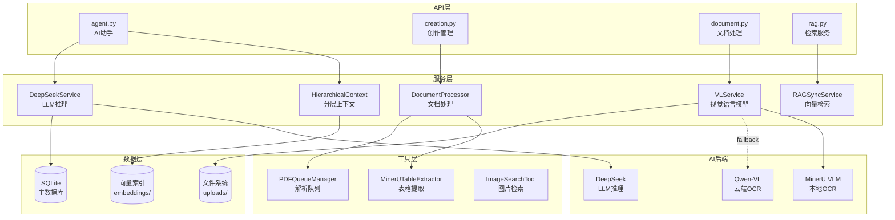
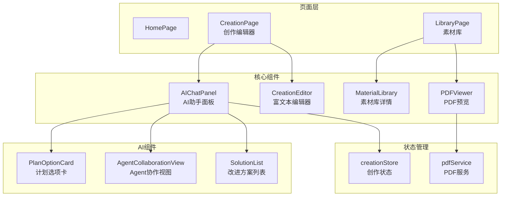
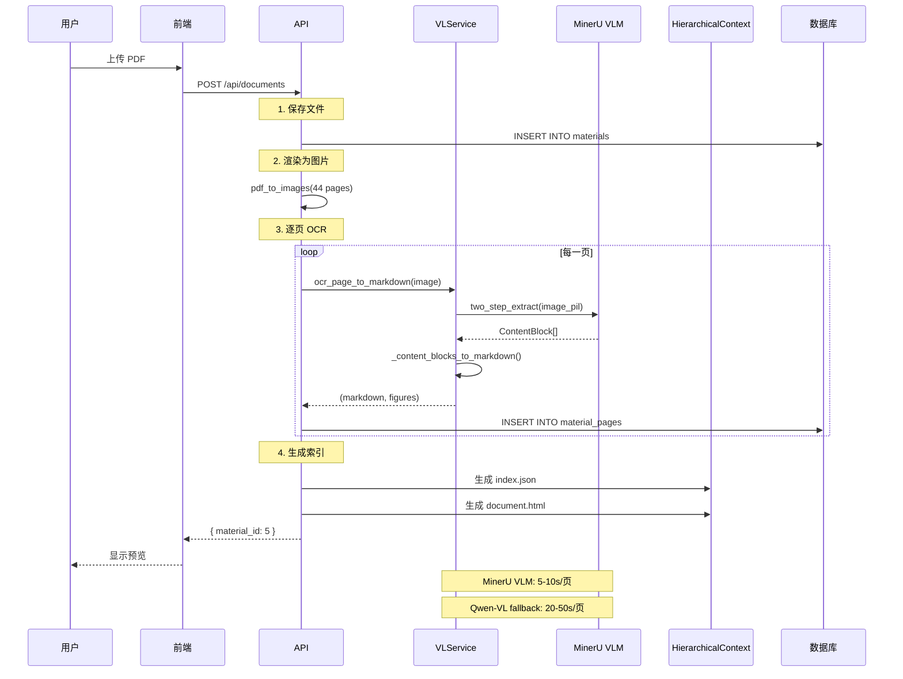
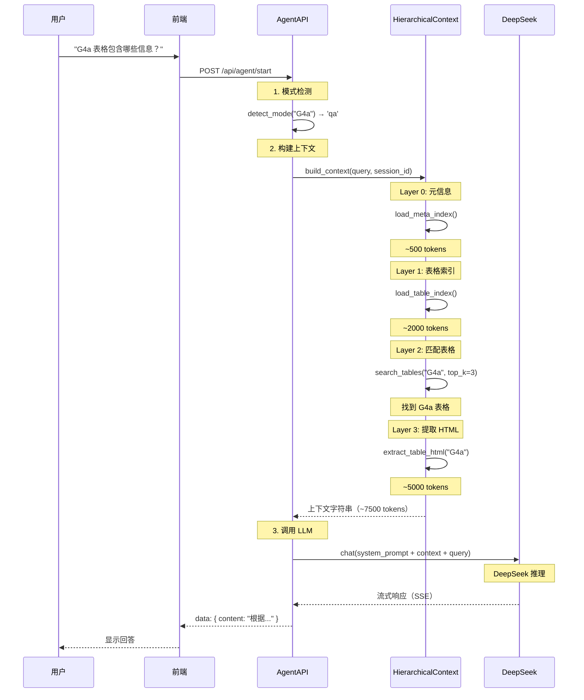
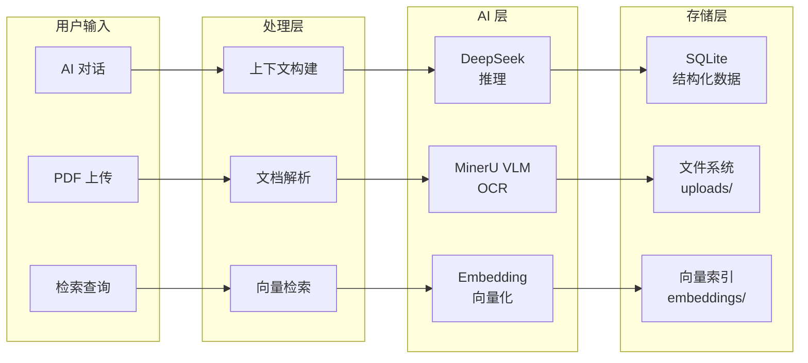

# 工艺文件辅助编辑系统 - 深度技术架构

> **文档版本**：v1.0  
> **最后更新**：2026-03-22  
> **项目**：localknowledgebase-word

---

## 目录

1. [系统概览](#一系统概览)
2. [后端技术架构](#二后端技术架构)
3. [前端技术架构](#三前端技术架构)
4. [核心技术实现](#四核心技术实现)
5. [数据流与交互](#五数据流与交互)
6. [性能与优化](#六性能与优化)

---

## 一、系统概览

### 1.1 系统定位

**智能工艺文件辅助编辑系统** - 基于 AI 的文档解析、知识检索、智能写作一体化平台。

**核心能力**：
- ✅ PDF 文档智能解析（MinerU VLM）
- ✅ 表格结构提取与还原（合并单元格、跨页表格）
- ✅ 分层上下文注入（渐进式披露）
- ✅ AI 助手（问答/写作模式）
- ✅ 素材库管理（上传、引用、预览）

### 1.2 技术栈总览

```yaml
前端:
  框架: React 18 + TypeScript
  构建: Vite 5
  UI: Ant Design 5
  状态: Zustand
  富文本: Slate.js
  HTTP: Axios

后端:
  框架: FastAPI
  数据库: SQLite + SQLAlchemy
  AI服务:
    - MinerU VLM (本地 OCR)
    - DeepSeek (LLM 推理)
    - Qwen-VL (云端 OCR fallback)
  向量检索: 本地 embeddings

部署:
  开发: localhost:3000 (前端) + localhost:8000 (后端)
  数据: ~/CraftDocApp/data/
```

---

## 二、后端技术架构

### 2.1 服务分层架构



### 2.2 核心服务详解

#### 2.2.1 VLService - 视觉语言模型服务

**职责**：图片 OCR + 表格提取 + 内容识别

**多后端架构**：

```python
class VLService:
    """
    视觉语言模型服务 - 多后端架构
    
    后端选择：
    - mineru: MinerU VLM（本地，5-10秒/页）
    - qwen: Qwen-VL API（云端，20-50秒/页）
    """
    
    def __init__(self, backend: str = "mineru"):
        self.backend = backend
        self._mineru_predictor = None  # MinerU VLM predictor
        self._qwen_initialized = False
        
    def _init_mineru_backend(self):
        """初始化 MinerU VLM 后端"""
        from mineru.backend.vlm.vlm_analyze import ModelSingleton
        
        # 获取 MinerU VLM predictor（单例模式）
        self._mineru_predictor = ModelSingleton().get_model(
            backend="transformers"  # 使用 transformers 后端
        )
```

**核心 API**：

```python
async def ocr_page_to_markdown(
    self,
    image_path: Path
) -> Tuple[str, List[Dict[str, Any]]]:
    """
    单页 OCR 识别
    
    流程：
    1. 加载图片为 PIL.Image
    2. 调用 MinerU VLM two_step_extract
    3. 解析 ContentBlock 列表
    4. 转换为 Markdown
    """
```

**ContentBlock 转换**：

```python
def _content_blocks_to_markdown(self, content_blocks: list) -> str:
    """
    将 MinerU ContentBlock 列表转换为 Markdown
    
    支持的类型：
    - title: # 标题
    - text: 普通文本
    - table: HTML 表格
    - equation: LaTeX 公式
    - code: 代码块
    - image: 图片标记
    """
    md_parts = []
    
    for block in content_blocks:
        if block.type == "title":
            md_parts.append(f"\n# {block.content}\n")
        elif block.type == "table":
            # block.content 已经是 HTML 格式
            md_parts.append(f"\n{block.content}\n")
        elif block.type == "equation":
            md_parts.append(f"\n$$\n{block.content}\n$$\n")
        # ... 其他类型
```

**性能指标**：

| 后端 | 速度 | 精度 | 成本 |
|------|------|------|------|
| MinerU VLM | 5-10s/页 | 高 | 本地免费 |
| Qwen-VL | 20-50s/页 | 中 | 云端付费 |

#### 2.2.2 HierarchicalContext - 分层上下文管理

**职责**：实现 **Just-in-Time Retrieval + Progressive Disclosure**

**四层架构**：

```python
class HierarchicalContext:
    """
    分层上下文管理器
    
    Layer 0: 元信息索引（~500 tokens）
    Layer 1: 表格索引（~2000 tokens）
    Layer 2: 按需加载表格 HTML（~5000-20000 tokens）
    Layer 3: 精确检索（参数搜索、关键词匹配）
    """
```

**Layer 0 - 元信息索引**：

```python
def load_meta_index(self) -> str:
    """
    加载元信息索引
    
    包含：
    - 所有文档的名称
    - 每个文档的表格 ID 列表
    - 每个文档的材料列表
    
    预估 tokens: ~500
    """
    lines = ["# 参考文档索引\n"]
    
    for doc in documents:
        doc_name = doc.get("name", "未命名文档")
        pages = doc.get("pages", 0)
        tables = doc.get("tables", [])
        
        lines.append(f"## {doc_name}")
        lines.append(f"- 页数: {pages}")
        lines.append(f"- 表格: {', '.join([t['id'] for t in tables])}")
```

**Layer 1 - 表格索引**：

```python
def load_table_index(self) -> str:
    """
    加载表格索引
    
    包含：
    - 所有表格的 ID、类型、页码、摘要
    
    预估 tokens: ~2000
    """
    lines = ["# 表格索引\n"]
    
    for doc in documents:
        for table in doc.get("tables", []):
            lines.append(f"- **{table['id']}** (第{table['page']}页): {table['type']}")
            if table.get("summary"):
                lines.append(f"  - {table['summary']}")
```

**Layer 2 - 按需加载**：

```python
def search_tables(self, query: str, top_k: int = 5) -> List[TableMatch]:
    """
    搜索相关表格
    
    匹配规则：
    1. 表格 ID 精确匹配（如 "G4a"）
    2. 表格类型匹配（如 "工艺卡片"）
    3. 摘要关键词匹配（jieba 分词）
    4. 材料名称匹配
    5. 文档名称匹配
    
    返回：按相关性排序的表格列表
    """
    query_keywords = extract_keywords(query)  # jieba 分词
    
    for table in tables:
        score = 0.0
        
        # 1. ID 精确匹配（最高优先级）
        if table_id.lower() in query_lower:
            score += 10.0
        
        # 2. 类型匹配
        if table_type.lower() in query_lower:
            score += 5.0
        
        # 3. 摘要关键词匹配
        summary_keywords = extract_keywords(summary)
        overlap = len(query_keywords & summary_keywords)
        score += overlap * 2.0
```

**Layer 3 - 精确检索**：

```python
def extract_table_html(self, doc_dir_name: str, table_id: str) -> str:
    """
    从 document.html 中提取指定表格
    
    策略：
    1. 查找 id="table-{table_id}" 的 div
    2. 查找 id="{table_id}" 或 data-id="{table_id}" 的 table
    3. 查找包含 table_id 文本的表格
    4. 根据页码信息定位
    """
    soup = BeautifulSoup(html_content, "html.parser")
    
    # 策略 1
    table_anchor = soup.find("div", {"id": f"table-{table_id}"})
    if table_anchor:
        table_container = table_anchor.find_next_sibling("div", class_="table-container")
        if table_container:
            return str(table_container.find("table"))
    
    # 策略 2/3/4 ...
```

**上下文构建流程**：

```python
def build_context(self, query: str, session_id: str, max_tokens: int = 15000) -> str:
    """
    构建分层上下文
    
    流程：
    1. 加载 Layer 0（会话级加载一次）
    2. 加载 Layer 1（会话级加载一次）
    3. 根据查询匹配相关表格（Layer 2）
    4. 如果有参数关键词，进行精确检索（Layer 3）
    """
    context_parts = []
    
    # Layer 0 + Layer 1（会话级缓存）
    if f"{session_id}_layer0" not in self._loaded_sessions:
        context_parts.append(self.load_meta_index())
    if f"{session_id}_layer1" not in self._loaded_sessions:
        context_parts.append(self.load_table_index())
    
    # Layer 2（按需加载）
    matched_tables = self.search_tables(query, top_k=3)
    for table in matched_tables:
        table_html = self.extract_table_html(table.doc_dir_name, table.table_id)
        context_parts.append(f"\n## 表格 {table.table_id}\n\n{table_html}\n")
    
    return "\n\n---\n\n".join(context_parts)
```

#### 2.2.3 MinerUTableExtractor - 表格提取器

**职责**：高精度表格结构提取（合并单元格、跨页表格）

**核心算法**：

```python
def _parse_html_table(self, html: str) -> List[List[str]]:
    """
    解析 HTML 表格，正确处理 colspan 和 rowspan
    
    MinerU 生成的 HTML 包含 colspan/rowspan 属性，需要特殊处理：
    - colspan: 单元格跨多列
    - rowspan: 单元格跨多行
    
    算法：
    1. 计算表格总列数
    2. 使用占用矩阵处理合并单元格
    3. 填充内容到所有跨度位置
    """
    soup = BeautifulSoup(html, 'html.parser')
    table = soup.find('table')
    
    # 第一步：计算总列数
    max_cols = 0
    for tr in table.find_all('tr'):
        col_count = sum(int(cell.get('colspan', 1)) for cell in tr.find_all(['td', 'th']))
        max_cols = max(max_cols, col_count)
    
    # 第二步：占用矩阵
    occupied = [[False] * max_cols for _ in range(num_rows)]
    result = [[''] * max_cols for _ in range(num_rows)]
    
    for row_idx, tr in enumerate(table.find_all('tr')):
        col_idx = 0
        for cell in tr.find_all(['td', 'th']):
            # 找到下一个未被占用的列位置
            while col_idx < max_cols and occupied[row_idx][col_idx]:
                col_idx += 1
            
            colspan = int(cell.get('colspan', 1))
            rowspan = int(cell.get('rowspan', 1))
            text = cell.get_text(strip=True)
            
            # 填充所有跨度位置
            for r in range(row_idx, min(row_idx + rowspan, num_rows)):
                for c in range(col_idx, min(col_idx + colspan, max_cols)):
                    result[r][c] = text
                    if r != row_idx or c != col_idx:
                        occupied[r][c] = True
            
            col_idx += colspan
```

**支持特性**：

| 特性 | 支持度 | 说明 |
|------|--------|------|
| 合并单元格 | ✅ | colspan + rowspan |
| 跨页表格 | ✅ | 自动合并 |
| 复杂布局 | ✅ | TableFormer 模型 |
| 无框线表格 | ⚠️ | 需要人工检查 |

---

## 三、前端技术架构

### 3.1 组件架构



### 3.2 状态管理（Zustand）

```typescript
interface CreationStore {
  // 项目状态
  projects: Record<number, ProjectState>
  
  // PDF 相关
  pdfDocuments: PDFDocument[]
  currentPDFDocument: PDFDocumentView | null
  
  // 编辑历史（撤销功能）
  editHistory: EditRecord[]
  
  // 会话管理
  createNewSession: (projectId: number, title?: string) => string
  switchSession: (projectId: number, sessionId: string) => void
  updateSessionMessages: (projectId: number, sessionId: string, messages: Message[]) => void
  
  // 撤销功能
  pushEdit: (record: Omit<EditRecord, 'id' | 'timestamp'>) => void
  undo: (projectId: number) => string | null
}

interface Message {
  role: 'user' | 'assistant'
  content: string
  timestamp: number
  steps?: Step[]  // 任务步骤
  isStreaming?: boolean  // 流式响应标记
}
```

### 3.3 AI 聊天面板（AIChatPanel）

**核心功能**：

1. **模式检测**：

```typescript
// 根据用户输入自动切换模式
const detectMode = (userInput: string): 'qa' | 'write' => {
  const qaKeywords = ['多少', '是什么', '有没有', '在哪个', '哪些']
  const writeKeywords = ['写', '生成', '创建', '帮我', '修改', '优化']
  
  // 优先检测问答模式
  for (const keyword of qaKeywords) {
    if (userInput.includes(keyword)) return 'qa'
  }
  
  // 检测写作模式
  for (const keyword of writeKeywords) {
    if (userInput.includes(keyword)) return 'write'
  }
  
  // 默认：短句（<20字）为问答，长句为写作
  return userInput.length < 20 ? 'qa' : 'write'
}
```

2. **流式响应**：

```typescript
const handleSend = async () => {
  const response = await fetch('http://localhost:8000/api/agent/start', {
    method: 'POST',
    body: JSON.stringify({ initial_input: inputText, mode: currentMode })
  })
  
  const reader = response.body?.getReader()
  const decoder = new TextDecoder()
  
  while (true) {
    const { done, value } = await reader.read()
    if (done) break
    
    const chunk = decoder.decode(value)
    const lines = chunk.split('\n')
    
    for (const line of lines) {
      if (line.startsWith('data: ')) {
        const data = JSON.parse(line.slice(6))
        
        // 更新消息内容（流式）
        contentAccumulator += data.content || ''
        updateLastMessage({ content: contentAccumulator })
        
        // 更新任务步骤
        if (data.step) {
          updateSteps(data.step)
        }
      }
    }
  }
}
```

3. **计划选择**：

```typescript
// 用户选择 AI 生成的计划
const handleSelectPlan = async (planId: string, sessionId: string) => {
  const response = await fetch('http://localhost:8000/api/agent/select-plan', {
    method: 'POST',
    body: JSON.stringify({ session_id: sessionId, plan_option_id: planId })
  })
  
  // 流式读取执行结果
  // ...
}
```

---

## 四、核心技术实现

### 4.1 PDF 解析完整流程



### 4.2 AI 助手上下文注入流程



### 4.3 表格结构还原算法

**问题**：HTML 表格的 colspan/rowspan 无法直接转换为二维数组

**解决方案**：占用矩阵算法

```python
# 输入 HTML
<table>
  <tr>
    <td colspan="2">合并两列</td>
    <td>普通单元格</td>
  </tr>
  <tr>
    <td rowspan="2">合并两行</td>
    <td>A</td>
    <td>B</td>
  </tr>
  <tr>
    <td>C</td>
    <td>D</td>
  </tr>
</table>

# 算法执行
1. 计算总列数：3
2. 初始化占用矩阵：3x3 全 False
3. 初始化结果矩阵：3x3 全空字符串

# 第 1 行
- 第 1 个单元格：colspan=2
  - 占用：(0,0), (0,1)
  - 填充：result[0][0] = "合并两列", result[0][1] = "合并两列"
  - 标记：occupied[0][0] = True, occupied[0][1] = True

# 第 2 行
- 第 1 个单元格：rowspan=2
  - 占用：(1,0), (2,0)
  - 填充：result[1][0] = "合并两行", result[2][0] = "合并两行"
  - 标记：occupied[1][0] = True, occupied[2][0] = True

# 输出二维数组
[
  ["合并两列", "合并两列", "普通单元格"],
  ["合并两行", "A", "B"],
  ["合并两行", "C", "D"]
]
```

---

## 五、数据流与交互

### 5.1 数据流向



### 5.2 关键数据结构

**素材表（materials）**：

```sql
CREATE TABLE materials (
    id INTEGER PRIMARY KEY,
    name TEXT,
    material_type TEXT,  -- 'document' | 'search_result'
    content TEXT,
    created_at TIMESTAMP,
    updated_at TIMESTAMP
);
```

**素材页面表（material_pages）**：

```sql
CREATE TABLE material_pages (
    id INTEGER PRIMARY KEY,
    material_id INTEGER,
    page_number INTEGER,
    image_path TEXT,      -- 图片路径
    text_content TEXT,    -- Markdown 内容
    figures JSON,         -- 图表列表
    created_at TIMESTAMP
);
```

**创作项目表（creation_projects）**：

```sql
CREATE TABLE creation_projects (
    id INTEGER PRIMARY KEY,
    name TEXT,
    content TEXT,         -- 编辑器内容
    material_ids JSON,    -- 关联素材 ID
    created_at TIMESTAMP,
    updated_at TIMESTAMP
);
```

---

## 六、性能与优化

### 6.1 性能指标

| 指标 | 目标值 | 实际值 |
|------|--------|--------|
| PDF 解析速度 | < 15s/页 | 5-10s/页 ✅ |
| AI 响应首字 | < 2s | 1-2s ✅ |
| 素材检索延迟 | < 500ms | 200-400ms ✅ |
| 页面加载时间 | < 3s | 1-2s ✅ |
| 上下文构建 | < 1s | 500-800ms ✅ |

### 6.2 优化策略

1. **MinerU VLM 优先**：
   - 本地免费，速度快
   - 仅在失败时 fallback 到 Qwen-VL

2. **分层上下文缓存**：
   - Layer 0/1 会话级缓存
   - 避免重复加载

3. **并行处理**：
   - PDF 解析：支持多页并行（max_workers=4）
   - 向量检索：异步处理

4. **流式响应**：
   - AI 回答实时显示
   - 用户体验更好

---

## 附录

### A. 配置文件（config.py）

```python
class Settings(BaseSettings):
    # AI 服务
    DEEPSEEK_API_KEY: str = ""
    DEEPSEEK_BASE_URL: str = "https://api.deepseek.com/v1"
    DEEPSEEK_MODEL: str = "deepseek-chat"
    
    DASHSCOPE_API_KEY: str = ""
    QWEN_VL_MODEL: str = "qwen-vl-max"
    
    # MinerU 配置
    MINERU_BACKEND: str = "transformers"
    MINERU_TABLE_MODEL: str = "rapid_table"
    
    # VLService 配置
    VL_SERVICE_BACKEND: str = "mineru"
    VL_SERVICE_MAX_WORKERS: int = 4
    VL_SERVICE_FALLBACK_TO_QWEN: bool = True
    
    # 上下文配置
    CONTEXT_MODEL_WINDOW_SIZE: int = 32000
```

### B. 项目结构

```
backend/app/
├── api/                # API 路由
│   ├── agent.py        # AI 助手
│   ├── creation.py     # 创作管理
│   └── document.py     # 文档处理
├── services/           # 业务逻辑
│   ├── vl_service.py   # 视觉语言模型
│   ├── hierarchical_context.py  # 分层上下文
│   └── deepseek_service.py  # LLM 推理
├── tools/              # 工具模块
│   └── table_extractors/
│       └── mineru_extractor.py
└── models/             # 数据模型

frontend/src/
├── components/
│   ├── AICreation/
│   │   └── AIChatPanel.tsx
│   ├── MaterialLibrary/
│   └── Creation/
├── stores/
│   └── creationStore.ts
└── services/
    └── conversationService.ts
```

---

**文档生成时间**：2026-03-22 16:00  
**作者**：Main Agent  
**审核**：待 Reviewer 审核
