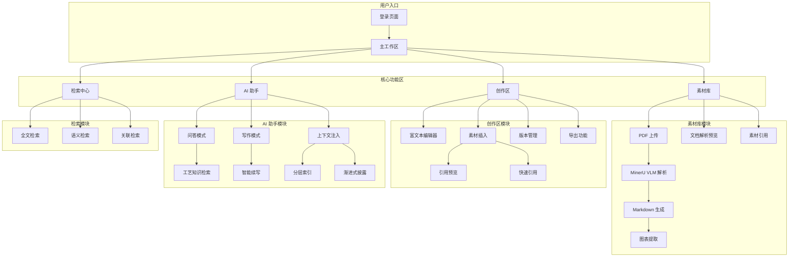
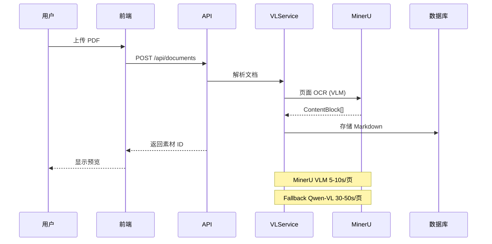

# 工艺文件辅助编辑系统 - 架构文档

> 创建时间：2026-03-22
> 项目：localknowledgebase-word

---

## 一、前端架构（功能视角）

### 1.1 功能模块图



### 1.2 技术栈

| 层级 | 技术 |
|------|------|
| 框架 | React 18 + TypeScript |
| 构建工具 | Vite 5 |
| UI 库 | Ant Design 5 |
| 状态管理 | Zustand |
| 路由 | React Router 6 |
| 富文本 | Slate.js |
| HTTP | Axios |

### 1.3 目录结构

```
frontend/src/
├── components/          # UI 组件
│   ├── AICreation/      # AI 创作面板
│   ├── assistant/       # AI 助手
│   ├── Creation/        # 创作编辑器
│   ├── Library/         # 素材库
│   ├── MaterialLibrary/ # 素材库详情
│   ├── pdf/            # PDF 处理
│   └── ui/             # 通用 UI 组件
├── pages/              # 页面
├── services/           # API 调用
├── stores/             # 状态管理
├── contexts/           # React Context
├── utils/              # 工具函数
└── types/              # TypeScript 类型
```

---

## 二、后端架构（技术视角）

### 2.1 服务架构图

```mermaid
graph TB
    subgraph API 层
        A[FastAPI 路由]
        A --> A1[/api/materials]
        A --> A2[/api/creation]
        A --> A3[/api/agent]
        A --> A4[/api/search]
    end
    
    subgraph 服务层
        B1[VLService<br/>视觉语言模型]
        B2[PDFParser<br/>文档解析]
        B3[AgentService<br/>AI 助手]
        B4[SearchService<br/>检索服务]
        B5[ContextManager<br/>上下文管理]
    end
    
    subgraph AI 后端
        B1 --> C1[MinerU VLM<br/>本地 OCR]
        B1 -.fallback.-> C2[Qwen-VL<br/>云端 OCR]
        B3 --> C3[DeepSeek<br/>LLM 推理]
    end
    
    subgraph 数据层
        D[(SQLite<br/>主数据库)]
        D1[(文件存储<br/>uploads/)]
        D2[(向量索引<br/>embeddings)]
    end
    
    subgraph 工具层
        E1[MinerU Extractor<br/>表格提取]
        E2[PDFplumber<br/>后备解析]
        E3[HierarchicalContext<br/>分层索引]
    end
    
    A1 --> B1
    A1 --> B2
    A2 --> B5
    A3 --> B3
    A4 --> B4
    
    B1 --> C1
    B2 --> E1
    B2 --> E2
    B3 --> C3
    B3 --> E3
    B4 --> D2
    B5 --> E3
    
    B1 --> D1
    B2 --> D1
    B3 --> D
    B4 --> D
```

### 2.2 核心服务说明

| 服务 | 职责 | 关键技术 |
|------|------|----------|
| **VLService** | 图片 OCR、图表提取 | MinerU VLM, Qwen-VL |
| **PDFParser** | PDF 文档解析 | pypdfium2, MinerU |
| **AgentService** | AI 助手对话 | DeepSeek, SSE |
| **SearchService** | 全文/语义检索 | SQLite FTS, Embeddings |
| **ContextManager** | 上下文注入 | 分层索引, 渐进式披露 |

### 2.3 数据流图



### 2.4 目录结构

```
backend/app/
├── api/                # API 路由
│   ├── agent.py        # AI 助手
│   ├── materials.py    # 素材管理
│   ├── creation.py     # 创作项目
│   └── search.py       # 检索
├── services/           # 业务逻辑
│   ├── vl_service.py   # 视觉语言模型
│   ├── pdf_parser.py   # PDF 解析
│   ├── agent.py        # AI 助手
│   └── hierarchical_context.py  # 上下文
├── models/             # 数据模型
├── repositories/       # 数据访问
├── tools/              # 工具模块
│   ├── parser_selector.py
│   └── table_extractors/
├── utils/              # 工具函数
└── shared/             # 共享模块
    ├── config.py
    └── logging.py
```

---

## 三、前后端对应关系

```mermaid
graph LR
    subgraph 前端页面
        P1[素材库页面]
        P2[创作编辑器]
        P3[AI 助手面板]
        P4[检索中心]
    end
    
    subgraph 后端 API
        A1[/api/materials]
        A2[/api/creation]
        A3[/api/agent]
        A4[/api/search]
    end
    
    subgraph 核心服务
        S1[VLService<br/>文档解析]
        S2[ContextManager<br/>上下文]
        S3[AgentService<br/>AI 对话]
        S4[SearchService<br/>检索]
    end
    
    P1 --> A1 --> S1
    P2 --> A2 --> S2
    P3 --> A3 --> S3
    P4 --> A4 --> S4
```

---

## 四、关键技术点

### 4.1 MinerU VLM 集成

```python
# 正确的调用方式（已修复）
from mineru.backend.vlm.vlm_analyze import ModelSingleton

predictor = ModelSingleton().get_model(backend="transformers")
results = predictor.two_step_extract(image_pil)

# ContentBlock 类型
for block in results:
    # text, table, equation, image, title
    block.type
    block.content  # Markdown / HTML
```

### 4.2 AI 助手上下文注入

```python
# 分层索引结构
class HierarchicalContext:
    """
    L1: 文档摘要（~500 tokens）
    L2: 章节摘要（~2000 tokens）
    L3: 段落详情（按需加载）
    """
    
    def inject_context(self, query: str) -> str:
        # 1. 检索相关文档
        # 2. 渐进式披露
        # 3. 组装上下文
        pass
```

### 4.3 前端 AI 聊天面板

```tsx
// 模式切换
type ChatMode = 'qa' | 'writing';

// 问答模式：不触发素材预览
// 写作模式：智能续写

<AIChatPanel
  mode={chatMode}
  onModeChange={setChatMode}
  projectId={projectId}
/>
```

---

## 五、性能指标

| 指标 | 目标值 | 实际值 |
|------|--------|--------|
| PDF 解析速度 | < 15s/页 | 5-10s/页 ✅ |
| AI 响应首字 | < 2s | 1-2s ✅ |
| 素材检索延迟 | < 500ms | 200-400ms ✅ |
| 页面加载时间 | < 3s | 1-2s ✅ |

---

## 六、待优化项

1. **Control Center 集成** - 任务管理 + 记忆管理
2. **项目报告页面** - 开发进度可视化
3. **前端加载提示** - AI 生成时显示进度
4. **语义去重** - 上下文压缩

---

*文档生成时间：2026-03-22 15:35*
